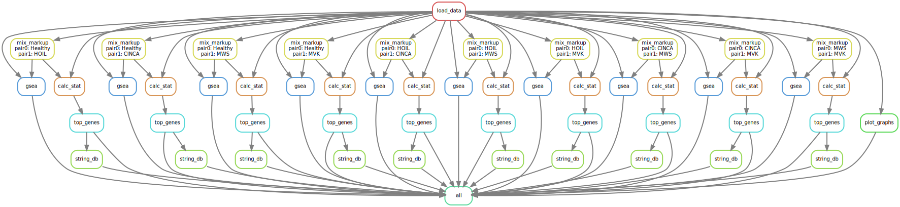

# hoil1
simple pipeline on snakemake for analysis hoil1 deficency

## Requirements
* Python 3.8
* R 4.0.2 

## Simple Installation
1) clone repository `git clone https://github.com/marcenavuc/hoil1`
2) Install r packat manager `renv` by typing `install.packages("renv")` in R
 console
3) Then type in R console `renv::restore("hoil1")`

### Libraries
On Python:
* snakemake

On R:
* all libraries described in renv.lock

## How to use
You can use this pipeline like simple snakemake pipeline.
For example, you can write `snakemake --cores=1` for start this pipeline.

